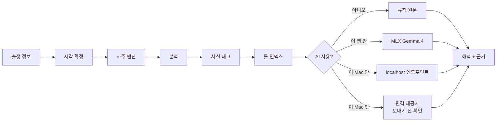

<p align="center">
  <picture>
    <source media="(prefers-color-scheme: dark)" srcset="docs/assets/logo-dark.svg">
    
  </picture>
</p>

<h1 align="center">four-eight</h1>

<p align="center">
  macOS를 위한 사주팔자 — 정확하게 계산하고, 이 Mac 안에서 해석합니다.
</p>

<p align="center">
  <a href="./README.md">English</a> | 한국어
</p>

<p align="center">
  <a href="https://github.com/waylake/four-eight/releases/latest"></a>
  <a href="https://github.com/waylake/four-eight/actions/workflows/ci.yml"></a>
  <a href="#요구-사항"></a>
  <a href="./LICENSE"></a>
</p>

<p align="center">
  <a href="https://waylake.github.io/four-eight/"><b>소개 페이지</b></a> ·
  <a href="https://github.com/waylake/four-eight/releases/latest">다운로드</a> ·
  <a href="./CHANGELOG.md">변경 내역</a>
</p>

## 소개

four-eight는 명식을 세우는 순서를 지킵니다. 월주를 관할하는 절기의 정확한 순간을 먼저 확정하고, 출생지 경도와 한국의 역대 표준시를 보정한 뒤에야 육십갑자를 부릅니다. 계산은 결정론적 Swift 엔진이 담당합니다. 로컬 언어 모델은 선택 사항이며, 그 결과를 받아 오직 한 가지 일만 합니다. 읽기 좋은 한국어로 바꾸는 것입니다.

**모델은 계산하지 않습니다.** 네 기둥, 십신, 대운은 전부 `SajuKit`이 산출하고, 해석의 각 단락에는 그 문장이 나온 근거 규칙이 칩으로 붙습니다. 칩을 누르면 원문이 보입니다.

- **어려운 경우에 맞습니다.** 절기 경계의 분 단위 판정, 한국의 UTC+8:30 시대, 1948~1960년과 1987~1988년 서머타임, 23시대 출생 논쟁을 모두 명시적으로 처리하고 공표 만세력 값으로 테스트합니다.
- **기본값에서는 아무것도 이 Mac을 떠나지 않습니다.** 생년월일시는 전송되지 않고, 네트워크는 원할 때 모델 파일을 내려받고 업데이트를 확인하는 데에만 쓰입니다. 0.3.0부터 원하시면 직접 지정한 OpenAI 호환 제공자에게 문장을 주문할 수 있는데, 그 경우 무엇이 어디로 나가는지 **처음 보내기 전에 원문으로** 보여 드립니다. 인물 이름과 생년월일시 원본은 그때도 나가지 않습니다.
- **유파가 갈리는 지점은 갈린다고 말합니다.** 진태양시, 야자시 처리, 대운수 끝처리는 침묵하는 가정이 아니라 설정입니다.

<p align="center">
  
</p>

## 판독은 이렇게 나옵니다

1988년 9월 5일 00시 50분, 서울 출생입니다. 기둥 하나를 부르기 전에 보정이 셋 겹치고, 각각이 답을 바꿉니다.

```
입력   1988-09-05 00:50  서울

       서머타임 (UTC+10)      →  표준시 23:50, 전날
       경도 126.978°E −32분   →  진태양시 23:18
       23시대 + 야자시 정책   →  일주는 9월 4일 유지, 시두만 익일 기준

명식   時    日    月    年
       壬    壬    庚    戊
       子    戌    申    辰
```

셋 중 하나만 빠져도 다른 명식이 나옵니다. 이 사례는 공표 만세력과 대조해 `PublishedCaseTests.case1988Sept`에 테스트로 박혀 있습니다.

| 명식 | 캘린더 |
|---|---|
|  |  |

## 기능

- **들어가는 문이 둘** — 명식을 한 번 읽거나, 오늘이 어떤 날인지 확인하거나. 같은 엔진입니다.
- **결정론적 엔진** — `SajuKit`은 런타임 의존성이 없는 독립 Swift 패키지입니다.
- **선택형 온디바이스 AI** — MLX 기반 Gemma 4 E2B 또는 E4B를 필요할 때 내려받습니다. 생성은 언제든 멈추고 이어갈 수 있으며, 이미 만든 섹션은 다시 쓰지 않습니다.
- **근거가 연결된 해석** — 각 섹션이 어떤 규칙에서 나왔는지 명식에서도, 캘린더에서도 표시합니다.
- **근거 기반 대화** — 명식에 대해 물어볼 수 있습니다. 모델은 확정된 사실과 매칭된 규칙만 받고, 모르는 것은 지어내지 말고 모른다고 답하도록 지시받습니다.
- **음양력** — 윤달을 포함한 한국 음력 변환을 천문 계산으로 직접 수행합니다.

### 날에 등급을 매기지 않습니다

캘린더는 어떤 날도 좋다거나 나쁘다고 말하지 않습니다. 명식과 **접점**이 있는 날(충·삼합·일간합)을 표시하고, 그날 어떤 성격의 기운이 실리는지만 서술합니다. 날에 등급을 매기는 것은 공포 마케팅이고, 근거를 보여주겠다는 이 앱의 취지와도 어긋납니다.

## 요구 사항

| | |
|---|---|
| macOS | 15.0 이상 |
| 칩 | Apple Silicon (M1 이상). MLX가 Metal 기반이라 Intel Mac은 지원하지 않습니다 |
| 디스크 | Gemma 4 E2B 약 3.6 GB, E4B 약 5.2 GB — 선택 사항 |
| 빌드 | Xcode 26.2 이상, [XcodeGen](https://github.com/yonaskolb/XcodeGen) |

모델이 없어도 앱은 완전하게 동작합니다. 규칙 엔진이 해석을 직접 조립합니다.

## 설치

### Homebrew (권장)

```bash
brew install --cask waylake/tap/four-eight
```

이 경로에는 별도 조작이 필요 없습니다. 아래 경고 화면을 보지 않습니다.

### 직접 내려받기

[최신 릴리스](https://github.com/waylake/four-eight/releases/latest)에서 `FourEight.zip`을 받아 압축을 풀고 `FourEight.app`을 `/Applications`로 옮깁니다.

> [!IMPORTANT]
> 이 앱은 Apple 공증(notarization)을 받지 않았습니다. Apple Developer Program은 연 $99이고 오픈소스 면제가 없습니다.
>
> 그래서 처음 열 때 **"손상되었기 때문에 열 수 없습니다"** 라는 경고가 뜹니다. 파일이 실제로 손상된 것이 아니라, macOS가 공증되지 않은 앱에 붙이는 문구입니다.

**해제 방법 — 터미널 (한 줄, 확실함)**

```bash
xattr -dr com.apple.quarantine /Applications/FourEight.app
```

**해제 방법 — 시스템 설정 (터미널 없이)**

macOS 15부터 우클릭 후 열기는 더 이상 동작하지 않습니다. 다음 순서를 지켜야 합니다.

1. `FourEight.app`을 한 번 실행합니다. **실패합니다.** 이 실패가 다음 단계의 버튼을 만듭니다.
2. **시스템 설정 → 개인정보 보호 및 보안**을 엽니다.
3. 아래로 스크롤해 **"그래도 열기"** 를 누릅니다. 이 버튼은 1단계 이후 약 1시간 동안만 보입니다.
4. 로그인 암호를 입력합니다.

한 번만 하면 됩니다. 이후 업데이트는 앱이 알아서 처리합니다.

### 소스에서 빌드

```bash
git clone https://github.com/waylake/four-eight.git
cd four-eight
xcodegen generate
open FourEight.xcodeproj
```

명령줄 빌드와 테스트는 [HACKING.md](./HACKING.md)를 참고하세요.

## 업데이트

앱이 하루에 한 번 새 버전을 확인하고 알려 드립니다. **무엇이 바뀌는지 확인하고 직접 승인하셔야 설치됩니다.** 이 앱은 사용자 모르게 스스로를 바꾸지 않습니다.

자동 확인이 싫으시면 설정 → 업데이트에서 끌 수 있습니다. 그때는 "지금 확인" 버튼으로 직접 확인하시면 됩니다.

만세력 계산 규칙이 바뀌는 업데이트는 릴리스 노트에 명시합니다. 이미 보신 명식의 결과가 달라질 수 있기 때문입니다.

### 문장을 어디서 쓸지 고를 수 있습니다

해설은 항상 근거 원문으로 조립돼 있고, AI 문장은 그 위에 얹는 선택 사항입니다. 얹기로 하셨다면 세 곳 중에서 고르실 수 있습니다.

| 어디 | 글이 이 Mac을 떠나는가 | 무엇이 필요한가 |
|---|---|---|
| 이 앱 안 (Gemma 4 / MLX) | 아니오 | 3.6 GB 다운로드, Apple Silicon |
| 이 Mac 안 (`localhost`의 Ollama·LM Studio 등) | 아니오 — 루프백입니다 | 그 서버를 직접 돌리고 있을 것 |
| 이 Mac 밖 (OpenAI 호환 제공자) | **예** | 주소, 모델 이름, API 키 |

**출력 토큰 상한을 기본으로 보내지 않습니다.** 추론 모델(DeepSeek·o 계열·Gemini 등)은 그 한도를 생각과 답변에 함께 쓰기 때문에, 낮게 잡으면 모델이 생각만 하다 끝나고 답변이 한 글자도 나오지 않으면서 요금은 나갑니다. 그리고 같은 모델도 제공자 라우트에 따라 상한이 32배까지 갈려서 앱이 고를 수 있는 옳은 숫자가 없습니다. 요금을 묶고 싶으시면 설정에서 값을 넣으실 수 있습니다.

세 번째를 고르시면 **처음 보내기 전에 실제로 나갈 글자를 그대로 보여 드립니다.** 체크박스가 아니라 원문입니다. 확인은 주소(호스트)마다 한 번만 묻습니다 — 매번 물으면 읽지 않고 누르는 습관이 생기고, 그러면 확인이 있는 것이 없는 것보다 나쁩니다.

두 번째는 묻지 않습니다. 루프백은 글이 기기를 벗어나지 않으므로 물을 것이 없고, 거기에도 같은 경고를 띄우면 경고가 진짜 필요한 자리에서 의미를 잃습니다.

이 Mac 밖으로 평문 `http`는 보내지 않습니다. 경고가 아니라 거부입니다 — API 키와 적어 주신 글이 같은 패킷에 실려 중간에 그대로 읽힙니다.

제공자 목록을 앱에 넣지 않았습니다. 이름을 늘어놓으면 앱이 그들을 보증하는 셈이 되는데 보낸 글을 어떻게 다루는지 확인할 방법이 없고, 주소와 정책은 시간이 지나면 바뀌므로 번들한 목록은 조용히 썩습니다. 학습 사용 여부와 보관 기간은 제공자 정책을 직접 확인하셔야 합니다.

자세한 근거는 [ADR 0011](docs/adr/0011-remote-provider-as-a-destination.md)에 있습니다.

## 사용법

1. <kbd>⌘</kbd><kbd>N</kbd>을 눌러 이름, 생년월일, 출생 시각, 출생지를 입력합니다.
2. 미리 보기 아래의 보정 표시줄을 확인합니다. 진태양시, 경도 보정, 서머타임 적용 여부가 그대로 나옵니다. 관행이 다르다고 판단되면 설정에서 바꿉니다.
3. 가운데 열에서 명식을 봅니다. 네 기둥, 지장간, 십신, 십이운성, 오행 분포, 대운이 표시됩니다.
4. 오른쪽에서 해석을 읽습니다. 근거 칩을 누르면 그 단락의 명리 규칙이 나옵니다.
5. 필요하면 설정 → 해석에서 문장을 쓸 곳을 고릅니다. 이 Mac의 Gemma 4를 내려받거나, 이미 쓰고 계신 OpenAI 호환 제공자 주소를 넣으시면 됩니다. 같은 내용이 자연스러운 문장으로 다시 쓰입니다.

## 동작 방식



설계에서 눈여겨볼 지점은 `E → F` 단계입니다. 사주는 천간 10, 지지 12, 십신 10, 오행 5로 온톨로지가 닫혀 있습니다. 그래서 검색을 벡터 유사도가 아니라 결정론적 태그 조회로 구현했습니다. 모델은 고정된 사실 집합과 고정된 규칙 원문을 받고, 그 둘을 엮는 일만 하도록 지시받습니다. 2B급 모델로 충분한 이유이자, 해석이 없는 기둥을 지어낼 수 없는 이유입니다.

자세한 내용: [docs/architecture.md](./docs/architecture.md) · [docs/saju-engine.md](./docs/saju-engine.md) · [docs/on-device-ai.md](./docs/on-device-ai.md)

## 정확도

엔진은 자기 자신이 아니라 외부에 공표된 값과 대조해 검증합니다.

| 검증 항목 | 범위 | 결과 |
|---|---|---|
| 절기 시각 | 공표값 50건, 1954~2026년 | ±90초 이내 |
| 공개 사주 사례 | 문서화된 7건 | 완전 일치 |
| 음양력 변환 | 2003년 전일 왕복 | 일관 |
| 일주 앵커 | 1900-01-01 갑술, 2000-01-01 무오 | 일치 |

공개 사례는 어려운 것으로 골랐습니다. UTC+8:30 시대에 서머타임이 겹친 경우, 절입 2분 뒤 출생, 야자시 경계 양쪽으로 갈리는 자정 전후 출생, 그리고 워싱턴 D.C. 출생입니다. 출처는 [docs/research/manseryeok-validation.md](./docs/research/manseryeok-validation.md)에 있습니다.

천문 계산: 태양 시황경은 VSOP87D 지구 계열(절단본), 장동은 IAU 1980, 삭은 Meeus 49장, ΔT는 관측 기반 표를 씁니다. 성력 파일도, 네트워크도, AGPL 의존성도 없습니다.

## 로드맵

| # | 단계 | 상태 |
|---|---|---|
| 1 | 결정론적 엔진 + 골든 테스트 | 완료 |
| 2 | 명식 캔버스, 대운, 설정 | 완료 |
| 3 | 근거 칩이 붙은 온디바이스 해석 | 완료 |
| 4 | 대화형 후속 질문 | 계획 |
| 5 | 운세 캘린더 (세운·월운·일진) | 계획 |
| 6 | 두 명식의 궁합 | 계획 |
| 7 | 명식 인쇄와 PDF 출력 | 계획 |

## 자주 묻는 질문

**기본값은 어떤 관행인가요?**
출생지 경도 기준 진태양시, 균시차 미반영, 야자시(일주는 유지하고 시두만 익일 기준), 대운수 3일 1년 반올림입니다. 네 가지 모두 설정에서 바꿀 수 있습니다.

**다른 앱과 결과가 다릅니다.**
대부분 23시대 처리나 경도 보정 차이입니다. 명식 상단의 보정 표시줄을 비교해 보세요. 무엇을 적용했는지 그대로 적혀 있습니다.

**출생 시각을 모르면요?**
시주를 비우고 삼주로 봅니다. 임의로 채우지 않습니다.

**데이터는 어디에 저장되나요?**
`~/Library/Application Support/FourEight/people.json`입니다. 모델은 Hugging Face 캐시에 저장되고, API 키는 이 Mac의 키체인에만 저장됩니다. 인물 정보와 모델 파일은 전송되지 않습니다.

**이건 점을 보는 앱인가요?**
전통 사상으로서의 자평명리를 충실히 구현한 것입니다. 해석은 참고용이며 의료·투자·법률 조언이 아닙니다.

## 기여

이슈와 풀 리퀘스트를 환영합니다. 절차는 [CONTRIBUTING.md](./CONTRIBUTING.md), 개발 환경은 [HACKING.md](./HACKING.md)를 보세요.

## 라이선스

MIT — [LICENSE](./LICENSE)를 참고하세요.

Gemma 4 모델은 Google이 Apache 2.0으로 배포하며 사용자가 실행 시점에 직접 내려받습니다. 이 저장소에는 모델 가중치가 포함되어 있지 않습니다. VSOP87 계열 데이터의 출처는 Bureau des Longitudes(Bretagnon & Francou, 1988)입니다.
