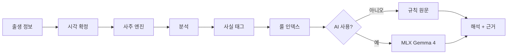

<p align="center">
  <picture>
    <source media="(prefers-color-scheme: dark)" srcset="docs/assets/logo-dark.svg">
    
  </picture>
</p>

<h1 align="center">four-eight</h1>

<p align="center">
  macOS를 위한 사주팔자 — 정확하게 계산하고, 이 Mac 안에서 해석합니다.
</p>

<p align="center">
  <a href="./README.md">English</a> | 한국어
</p>

<p align="center">
  <a href="https://github.com/waylake/four-eight/actions/workflows/ci.yml"></a>
  <a href="#요구-사항"></a>
  <a href="./LICENSE"></a>
</p>

## 소개

four-eight는 명식을 세우는 순서를 지킵니다. 월주를 관할하는 절기의 정확한 순간을 먼저 확정하고, 출생지 경도와 한국의 역대 표준시를 보정한 뒤에야 육십갑자를 부릅니다. 계산은 결정론적 Swift 엔진이 담당합니다. 로컬 언어 모델은 선택 사항이며, 그 결과를 받아 오직 한 가지 일만 합니다. 읽기 좋은 한국어로 바꾸는 것입니다.

**모델은 계산하지 않습니다.** 네 기둥, 십신, 대운은 전부 `SajuKit`이 산출하고, 해석의 각 단락에는 그 문장이 나온 근거 규칙이 칩으로 붙습니다. 칩을 누르면 원문이 보입니다.

- **어려운 경우에 맞습니다.** 절기 경계의 분 단위 판정, 한국의 UTC+8:30 시대, 1948~1960년과 1987~1988년 서머타임, 23시대 출생 논쟁을 모두 명시적으로 처리하고 공표 만세력 값으로 테스트합니다.
- **아무것도 이 Mac을 떠나지 않습니다.** 생년월일시는 전송되지 않습니다. 네트워크는 원할 때 모델 파일을 내려받는 데에만 쓰입니다.
- **유파가 갈리는 지점은 갈린다고 말합니다.** 진태양시, 야자시 처리, 대운수 끝처리는 침묵하는 가정이 아니라 설정입니다.

## 스크린샷

> [!NOTE]
> 스크린샷은 첫 태그 릴리스와 함께 추가됩니다. 지금은 소스에서 빌드해 확인할 수 있습니다.

## 기능

- **네이티브 SwiftUI** — 3컬럼 레이아웃, 메뉴바 일진, 설정 창, 다크 모드.
- **결정론적 엔진** — `SajuKit`은 런타임 의존성이 없는 독립 Swift 패키지입니다.
- **선택형 온디바이스 AI** — MLX 기반 Gemma 4 E2B 또는 E4B를 필요할 때 내려받습니다.
- **근거가 연결된 해석** — 각 섹션이 어떤 규칙에서 나왔는지 표시합니다.
- **음양력** — 윤달을 포함한 한국 음력 변환을 천문 계산으로 직접 수행합니다.

## 요구 사항

| | |
|---|---|
| macOS | 15.0 이상 |
| 칩 | Apple Silicon (온디바이스 AI에 필요. 계산 엔진 자체는 제약 없음) |
| 디스크 | Gemma 4 E2B 약 3.6 GB, E4B 약 5.2 GB — 선택 사항 |
| 빌드 | Xcode 26.2 이상, [XcodeGen](https://github.com/yonaskolb/XcodeGen) |

모델이 없어도 앱은 완전하게 동작합니다. 규칙 엔진이 해석을 직접 조립합니다.

## 설치

소스에서 빌드합니다.

```bash
git clone https://github.com/waylake/four-eight.git
cd four-eight
xcodegen generate
open FourEight.xcodeproj
```

명령줄 빌드와 테스트는 [HACKING.md](./HACKING.md)를 참고하세요.

## 사용법

1. <kbd>⌘</kbd><kbd>N</kbd>을 눌러 이름, 생년월일, 출생 시각, 출생지를 입력합니다.
2. 미리 보기 아래의 보정 표시줄을 확인합니다. 진태양시, 경도 보정, 서머타임 적용 여부가 그대로 나옵니다. 관행이 다르다고 판단되면 설정에서 바꿉니다.
3. 가운데 열에서 명식을 봅니다. 네 기둥, 지장간, 십신, 십이운성, 오행 분포, 대운이 표시됩니다.
4. 오른쪽에서 해석을 읽습니다. 근거 칩을 누르면 그 단락의 명리 규칙이 나옵니다.
5. 필요하면 설정 → 모델에서 Gemma 4를 설치합니다. 같은 내용이 자연스러운 문장으로 다시 쓰입니다.

## 동작 방식



설계에서 눈여겨볼 지점은 `E → F` 단계입니다. 사주는 천간 10, 지지 12, 십신 10, 오행 5로 온톨로지가 닫혀 있습니다. 그래서 검색을 벡터 유사도가 아니라 결정론적 태그 조회로 구현했습니다. 모델은 고정된 사실 집합과 고정된 규칙 원문을 받고, 그 둘을 엮는 일만 하도록 지시받습니다. 2B급 모델로 충분한 이유이자, 해석이 없는 기둥을 지어낼 수 없는 이유입니다.

자세한 내용: [docs/architecture.md](./docs/architecture.md) · [docs/saju-engine.md](./docs/saju-engine.md) · [docs/on-device-ai.md](./docs/on-device-ai.md)

## 정확도

엔진은 자기 자신이 아니라 외부에 공표된 값과 대조해 검증합니다.

| 검증 항목 | 범위 | 결과 |
|---|---|---|
| 절기 시각 | 공표값 50건, 1954~2026년 | ±90초 이내 |
| 공개 사주 사례 | 문서화된 7건 | 완전 일치 |
| 음양력 변환 | 2003년 전일 왕복 | 일관 |
| 일주 앵커 | 1900-01-01 갑술, 2000-01-01 무오 | 일치 |

공개 사례는 어려운 것으로 골랐습니다. UTC+8:30 시대에 서머타임이 겹친 경우, 절입 2분 뒤 출생, 야자시 경계 양쪽으로 갈리는 자정 전후 출생, 그리고 워싱턴 D.C. 출생입니다. 출처는 [docs/research/manseryeok-validation.md](./docs/research/manseryeok-validation.md)에 있습니다.

천문 계산: 태양 시황경은 VSOP87D 지구 계열(절단본), 장동은 IAU 1980, 삭은 Meeus 49장, ΔT는 관측 기반 표를 씁니다. 성력 파일도, 네트워크도, AGPL 의존성도 없습니다.

## 로드맵

| # | 단계 | 상태 |
|---|---|---|
| 1 | 결정론적 엔진 + 골든 테스트 | 완료 |
| 2 | 명식 캔버스, 대운, 설정 | 완료 |
| 3 | 근거 칩이 붙은 온디바이스 해석 | 완료 |
| 4 | 대화형 후속 질문 | 계획 |
| 5 | 운세 캘린더 (세운·월운·일진) | 계획 |
| 6 | 두 명식의 궁합 | 계획 |
| 7 | 명식 인쇄와 PDF 출력 | 계획 |

## 자주 묻는 질문

**기본값은 어떤 관행인가요?**
출생지 경도 기준 진태양시, 균시차 미반영, 야자시(일주는 유지하고 시두만 익일 기준), 대운수 3일 1년 반올림입니다. 네 가지 모두 설정에서 바꿀 수 있습니다.

**다른 앱과 결과가 다릅니다.**
대부분 23시대 처리나 경도 보정 차이입니다. 명식 상단의 보정 표시줄을 비교해 보세요. 무엇을 적용했는지 그대로 적혀 있습니다.

**출생 시각을 모르면요?**
시주를 비우고 삼주로 봅니다. 임의로 채우지 않습니다.

**데이터는 어디에 저장되나요?**
`~/Library/Application Support/FourEight/people.json`입니다. 모델은 Hugging Face 캐시에 저장됩니다. 둘 다 전송되지 않습니다.

**이건 점을 보는 앱인가요?**
전통 사상으로서의 자평명리를 충실히 구현한 것입니다. 해석은 참고용이며 의료·투자·법률 조언이 아닙니다.

## 기여

이슈와 풀 리퀘스트를 환영합니다. 절차는 [CONTRIBUTING.md](./CONTRIBUTING.md), 개발 환경은 [HACKING.md](./HACKING.md)를 보세요.

## 라이선스

MIT — [LICENSE](./LICENSE)를 참고하세요.

Gemma 4 모델은 Google이 Apache 2.0으로 배포하며 사용자가 실행 시점에 직접 내려받습니다. 이 저장소에는 모델 가중치가 포함되어 있지 않습니다. VSOP87 계열 데이터의 출처는 Bureau des Longitudes(Bretagnon & Francou, 1988)입니다.
