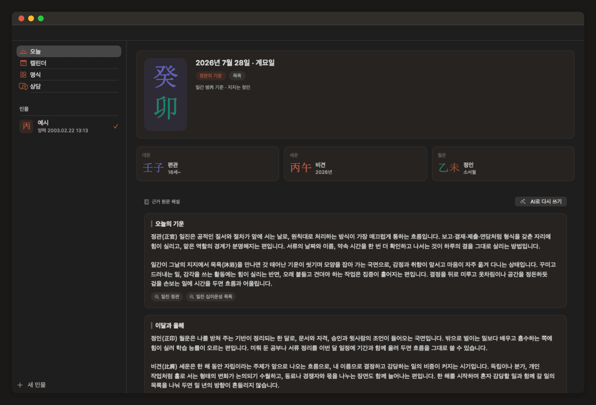
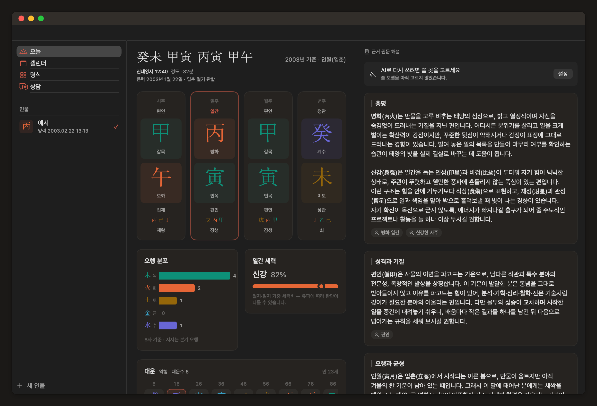
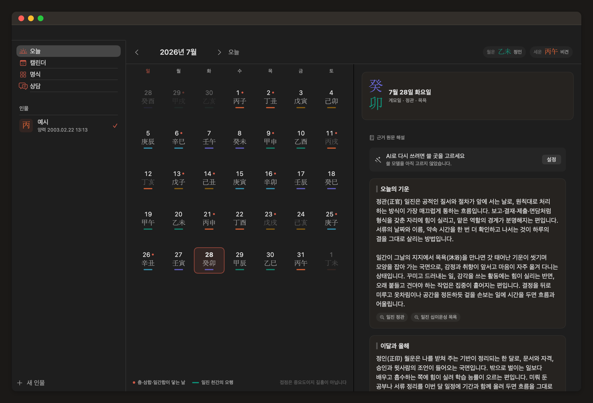
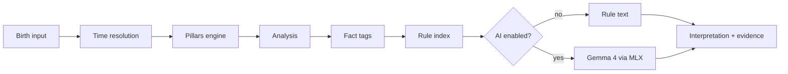

<p align="center">
  <picture>
    <source media="(prefers-color-scheme: dark)" srcset="docs/assets/logo-dark.svg">
    
  </picture>
</p>

<h1 align="center">four-eight</h1>

<p align="center">
  Four Pillars of Destiny (사주팔자) for macOS — computed precisely, interpreted entirely on your Mac.
</p>

<p align="center">
  English | <a href="./README.ko.md">한국어</a>
</p>

<p align="center">
  <a href="https://github.com/waylake/four-eight/releases/latest"></a>
  <a href="https://github.com/waylake/four-eight/actions/workflows/ci.yml"></a>
  <a href="#requirements"></a>
  <a href="./LICENSE"></a>
</p>

<p align="center">
  <a href="https://waylake.github.io/four-eight/"><b>Website</b></a> ·
  <a href="https://github.com/waylake/four-eight/releases/latest">Download</a> ·
  <a href="./CHANGELOG.md">Changelog</a>
</p>

## About

four-eight reads a Four Pillars chart the way a careful practitioner would: it resolves the exact instant of the governing solar term, corrects for the longitude of the birthplace and for Korea's historical time zones, and only then names the sixty-cycle stems and branches. The chart is computed by a deterministic Swift engine. A local language model — if you choose to install one — is given those results and asked to do one thing: turn them into readable Korean prose.

**The model never calculates.** Every pillar, ten-god, and luck cycle comes from `SajuKit`, and every sentence in the interpretation carries a visible chip naming the rule it came from. Click the chip and you see the source text.

- **Correct on the hard cases.** Solar-term boundaries to the minute, Korea's UTC+8:30 eras, the 1948–1960 and 1987–1988 daylight-saving periods, and the 23:00 hour dispute — all handled explicitly, all covered by tests against published almanacs.
- **Nothing leaves your Mac.** Birth data is never transmitted. The network is used for exactly one thing: downloading a model file, if you want one.
- **Schools disagree, so the app says so.** True solar time, the 야자시 policy, and luck-cycle rounding are settings, not silent assumptions.

<p align="center">
  
</p>

## What a reading looks like

A birth of 1988-09-05 00:50 in Seoul. Three corrections stack up before a single pillar is named — and each one changes the answer.

```
입력   1988-09-05 00:50  서울

       KDT (UTC+10)          →  표준시 23:50, 전날
       경도 126.978°E −32분   →  진태양시 23:18
       23시대 + 야자시 정책   →  일주는 9월 4일 유지, 시두만 익일 기준

명식   時    日    月    年
       壬    壬    庚    戊
       子    戌    申    辰
```

Drop any one of those corrections and you get a different chart. This case is in the test suite as `PublishedCaseTests.case1988Sept`, matched against a published almanac.

| Chart | Calendar |
|---|---|
|  |  |

## Features

- **Two ways in** — read the chart once, or check what today carries. Both are the same engine.
- **Deterministic engine** — `SajuKit` is a standalone Swift package with no runtime dependencies.
- **Optional on-device AI** — Gemma 4 E2B or E4B via MLX, downloaded on demand. Stop and resume generation at any point; finished sections are never rewritten.
- **Evidence-linked interpretation** — every section shows which rules produced it, in the chart *and* in the calendar.
- **Grounded conversation** — ask about your chart. The model gets the facts and the matched rules, and is told to say it doesn't know rather than invent.
- **Lunar calendar** — Korean 음양력 conversion including leap months, computed from first principles.

### Days are not ranked

The calendar never labels a day good or bad. It marks days that *contact* your chart — a clash, a trine completion, a stem combination — and describes what kind of energy the day carries. Ranking days is fear marketing, and it contradicts the point of showing your evidence.

## Requirements

| | |
|---|---|
| macOS | 15.0 or later |
| Chip | Apple Silicon (M1 or later). Intel Macs are not supported — MLX is Metal-based |
| Disk | ~3.6 GB for Gemma 4 E2B, ~5.2 GB for E4B — optional |
| Build | Xcode 26.2+, [XcodeGen](https://github.com/yonaskolb/XcodeGen) |

The app is fully functional without any model: the rule engine composes the interpretation directly.

## Install

### Homebrew (recommended)

```bash
brew install --cask waylake/tap/four-eight
```

Nothing else to do. This path never shows the warning below.

### Direct download

Grab `FourEight.zip` from the [latest release](https://github.com/waylake/four-eight/releases/latest), unzip it, and move `FourEight.app` to `/Applications`.

> [!IMPORTANT]
> This app is not notarized by Apple. The Apple Developer Program costs $99/year and has no open-source exemption.
>
> So the first launch shows **"is damaged and can't be opened."** The file is not actually damaged — that is what macOS says about apps it can't verify.

**Fix it in Terminal (one line, reliable)**

```bash
xattr -dr com.apple.quarantine /Applications/FourEight.app
```

**Fix it in System Settings (no Terminal)**

Control-clicking to open no longer works as of macOS 15. The order matters:

1. Launch `FourEight.app` once. **It will fail.** That failure is what creates the button in step 3.
2. Open **System Settings → Privacy & Security**.
3. Scroll down and click **Open Anyway**. This button is only visible for about an hour after step 1.
4. Enter your login password.

Once is enough. Updates after that are handled by the app.

### Build from source

```bash
git clone https://github.com/waylake/four-eight.git
cd four-eight
xcodegen generate
open FourEight.xcodeproj
```

See [HACKING.md](./HACKING.md) for the command-line build and test workflow.

## Updates

The app checks once a day and tells you when a new version exists. **You see what changed and approve it before anything installs.** This app does not rewrite itself behind your back.

Turn the check off in Settings → Updates if you prefer; the "Check now" button stays.

Releases that change how charts are computed say so in the release notes, because a chart you already read may come out differently.

## Usage

1. Press <kbd>⌘</kbd><kbd>N</kbd> and enter a name, birth date, time, and birthplace.
2. Watch the correction line under the preview — it shows the true solar time, the longitude offset, and whether daylight saving applied. If you disagree with a convention, change it in Settings.
3. Read the chart in the centre column: four pillars, hidden stems, ten gods, twelve stages, five-element distribution, luck cycles.
4. Read the interpretation on the right. Click any evidence chip to see the rule behind a passage.
5. Optionally open Settings → Models and install Gemma 4 to have the same content rewritten as flowing prose.

## How it works



The interesting design choice is step `E → F`. Four Pillars has a closed ontology — ten stems, twelve branches, ten gods, five elements — so retrieval is a deterministic tag lookup, not vector similarity. The model receives a fixed set of facts and a fixed set of rule texts, and is instructed to combine them and nothing else. That is why a 2B-parameter model is sufficient, and why the interpretation cannot invent a pillar that isn't there.

Details: [docs/architecture.md](./docs/architecture.md) · [docs/saju-engine.md](./docs/saju-engine.md) · [docs/on-device-ai.md](./docs/on-device-ai.md)

## Accuracy

The engine is verified against published almanac data rather than against itself.

| Check | Coverage | Result |
|---|---|---|
| Solar term instants | 50 published times, 1954–2026 | within ±90 s |
| Published charts | 7 documented cases | exact match |
| Lunar conversion | round trip, every day of 2003 | consistent |
| Day pillar anchors | 1900-01-01 甲戌, 2000-01-01 戊午 | exact |

The published cases were chosen because they are hard: daylight saving overlapping a UTC+8:30 era, a birth two minutes after a solar term, midnight births that land on either side of the 야자시 boundary, and a birth in Washington D.C. Sources are listed in [docs/research/manseryeok-validation.md](./docs/research/manseryeok-validation.md).

Astronomy: VSOP87D truncated Earth series for apparent solar longitude, IAU 1980 nutation, Meeus chapter 49 for new moons, tabulated ΔT. No ephemeris files, no network, no AGPL dependency.

## Roadmap

| # | Step | Status |
|---|---|---|
| 1 | Deterministic engine + golden tests | Done |
| 2 | Chart canvas, luck cycles, settings | Done |
| 3 | On-device interpretation with evidence chips | Done |
| 4 | Conversational follow-up questions | Planned |
| 5 | Fortune calendar (annual, monthly, daily) | Planned |
| 6 | Compatibility between two charts | Planned |
| 7 | Print and PDF chart output | Planned |

## FAQ

**Which conventions does the app use by default?**
True solar time from the birthplace longitude, no equation of time, 야자시 (the day pillar holds; only the hour stem advances), and luck-cycle rounding at 3 days per year. All four are configurable.

**Why does my chart differ from another app?**
Almost always the 23:00 hour or the longitude correction. Compare the correction line under the chart header — it states exactly what was applied.

**What if I don't know the birth time?**
The hour pillar is left empty and the chart is read as three pillars. Nothing is guessed.

**Where is my data stored?**
`~/Library/Application Support/FourEight/people.json`. Models go to the Hugging Face cache. Neither is transmitted.

**Is this fortune telling?**
It is a faithful implementation of 자평명리 as a body of traditional thought. The interpretations are reference material, not medical, financial, or legal advice.

## Contributing

Issues and pull requests are welcome. See [CONTRIBUTING.md](./CONTRIBUTING.md) for the process and [HACKING.md](./HACKING.md) for the development setup.

## License

MIT — see [LICENSE](./LICENSE).

Gemma 4 models are distributed by Google under Apache 2.0 and are downloaded by the user at runtime; this repository contains no model weights. VSOP87 series data originates from the Bureau des Longitudes (Bretagnon & Francou, 1988).
