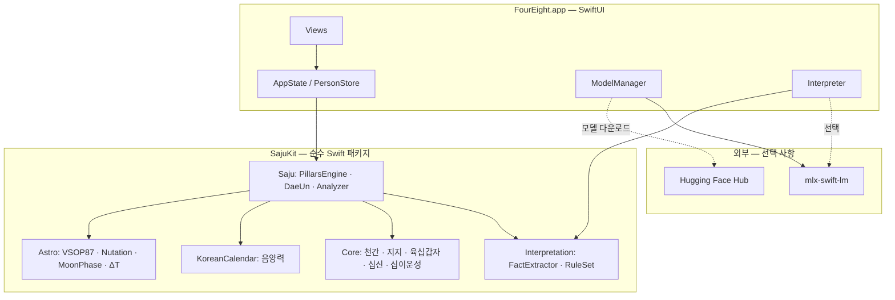
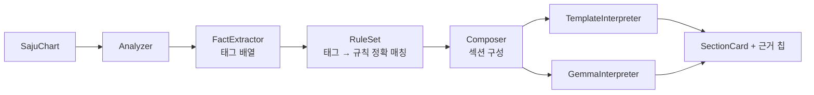

# Architecture

four-eight는 두 겹으로 나뉩니다. 아래층은 어떤 입력에도 같은 답을 내는 결정론적 계산 엔진이고, 위층은 그 결과를 사람이 읽을 문장으로 바꾸는 표현 계층입니다. 이 경계를 흐리지 않는 것이 이 프로젝트의 유일한 구조적 원칙입니다.

## 전체 구성



`SajuKit`은 Foundation 외에 어떤 것에도 의존하지 않습니다. MLX도, 네트워크도, 파일 시스템도 필요 없습니다. 그래서 CI에서 Linux로도 테스트할 수 있고, 앱이 없어도 다른 프로젝트가 그대로 가져다 쓸 수 있습니다.

## 계산 경로

출생 정보 하나가 명식이 되기까지 거치는 순서입니다. 순서가 곧 정확도입니다.

| 단계 | 하는 일 | 근거 |
|---|---|---|
| 1 | 음력 입력이면 양력으로 변환 | `KoreanLunarCalendar` |
| 2 | 벽시계 시각 → UTC 순간 | IANA tzdb (역대 표준시·서머타임) |
| 3 | UTC → 진태양시 (경도, 선택적 균시차) | `SajuOptions.solarTimeMode` |
| 4 | 년주 — 입춘 절입 순간과 비교 | `SolarTerms.instant(of:.ipchun:)` |
| 5 | 월주 — 관할 절(節) 판정 후 월두법 | `SolarTerms.governingJeol(at:)` |
| 6 | 일주 — 진태양시 날짜의 율리우스일 | `(JDN + 49) % 60` |
| 7 | 시주 — 진태양시 시각 + 시두법 + 자시 정책 | `SajuOptions.jasiPolicy` |

3단계와 4단계가 서로 다른 시간을 쓴다는 점이 중요합니다. 절기는 천문 현상이므로 UTC 순간으로 비교하고, 일주와 시주는 그 사람이 있던 자리의 태양 위치를 따르므로 진태양시로 판정합니다. 이 둘을 하나로 합치면 경계 사례에서 틀립니다.

## 해석 경로



`FactExtractor`가 내는 것은 문장이 아니라 태그입니다. `ilgan:병`, `strength:신강`, `oheng_excess:목`, `sibsin:편재` 같은 것들입니다. `RuleSet`은 이 태그로 규칙을 정확히 조회합니다. 유사도 검색이 아닙니다.

사주는 천간 10, 지지 12, 십신 10, 오행 5로 온톨로지가 완전히 닫혀 있습니다. 닫힌 집합에서는 임베딩이 필요 없고, 정확 매칭이 더 정확합니다. 이 선택의 부수 효과가 큽니다. 어떤 문장이 어떤 규칙에서 나왔는지 항상 알 수 있고, 그래서 UI에 근거 칩을 붙일 수 있습니다.

`Interpreter` 프로토콜에는 구현이 둘 있습니다. `TemplateInterpreter`는 규칙 원문을 그대로 조립하고, `GemmaInterpreter`는 같은 규칙 원문을 모델에게 주어 다시 쓰게 합니다. 두 경로가 내는 내용은 같고 문체만 다릅니다. 모델이 없어도 앱이 완전한 이유입니다.

## 모델이 계산하지 않는다는 것

`GemmaInterpreter`의 프롬프트는 두 블록으로 고정됩니다.

```
[명식 사실]   — FactExtractor가 만든 요약 라인. 이미 확정된 값.
[근거]        — RuleSet이 선별한 규칙 원문.
```

시스템 지시는 "제공된 내용만 사용하고, 새로운 간지나 십신을 만들지 말 것"을 명시합니다. 모델에게 남은 자유도는 문장 구성뿐입니다. 이것이 유효 파라미터 2B 모델로 충분한 이유이고, 동시에 이 앱이 명식을 틀리게 말할 수 없는 이유입니다.

## 유파 차이의 표면화

`SajuOptions`의 네 필드는 모두 명리 유파가 실제로 갈리는 지점입니다.

| 옵션 | 갈리는 이유 |
|---|---|
| `solarTimeMode` | 경도 기준, 30분 고정, 무보정이 모두 실무에서 쓰입니다 |
| `applyEquationOfTime` | 균시차까지 반영하는 계보가 별도로 있습니다 |
| `jasiPolicy` | 23시대 일주 처리는 정통 계보가 둘 다 있습니다 |
| `daeunRounding` | 대운수 나머지 처리 관행이 다릅니다 |

기본값을 정하되 그것을 정답이라 부르지 않는 것이 이 앱의 태도입니다. 근거는 [docs/research/manseryeok-validation.md](./research/manseryeok-validation.md)에 있습니다.

## 데이터가 놓이는 자리

| 대상 | 위치 | 전송 |
|---|---|---|
| 인물 목록 | `~/Library/Application Support/FourEight/people.json` | 없음 |
| 계산 옵션 | `UserDefaults` | 없음 |
| 모델 가중치 | Hugging Face 캐시 | 다운로드 시에만 |
| 절기·음력 | 계산 — 저장하지 않음 | 없음 |

앱 샌드박스에서 켜는 권한은 `network.client` 하나이고, 쓰이는 곳은 모델 다운로드뿐입니다.

## 관련 문서

- [saju-engine.md](./saju-engine.md) — 계산 규칙과 천문 알고리즘
- [on-device-ai.md](./on-device-ai.md) — 모델 선정과 프롬프트 전략
- [adr/](./adr/) — 구조적 결정 기록
- [research/](./research/) — 조사 노트
