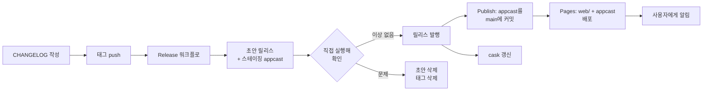

# 릴리스

태그 하나로 시작하고, 사람이 확인한 뒤 발행합니다.

## 흐름



발행이 관문입니다. 태그를 밀어도 사용자에게는 아무 일도 일어나지 않습니다. **릴리스를 발행하는 행위가 appcast를 살립니다.**

이 관문이 1인 프로젝트에 더 필요합니다. 잘못 나간 appcast 항목은 되돌릴 수 없습니다. 구버전 사용자가 이미 그 항목을 근거로 판단하기 때문에 append-only로 다뤄야 합니다.

## 절차

### 1. CHANGELOG를 쓴다

릴리스 노트의 정본은 `CHANGELOG.md`입니다. GitHub 릴리스 본문과 앱 안의 업데이트 설명이 모두 여기서 파생됩니다.

```markdown
## [0.2.0] - 2026-08-01

### Added

- 오늘 화면과 운세 캘린더.

### Fixed

- ⌘N을 누르면 해석이 다시 생성되던 문제.
```

버전 형식이 정확해야 합니다. 워크플로가 이 헤딩을 찾지 못하면 실패합니다.

### 2. 태그를 민다

```bash
git tag v0.2.0
git push origin v0.2.0
```

태그는 로컬에서 찍어 밉니다. GitHub UI에서 릴리스를 만들며 태그를 생성하지 않습니다 — 릴리스는 워크플로의 산출물이어야 하므로 순서가 뒤집히면 안 됩니다.

### 3. 초안을 확인한다

워크플로가 초안 릴리스를 만듭니다. **반드시 내려받아 실행해 보십시오.** 여기가 되돌릴 수 있는 마지막 지점입니다.

```bash
mkdir -p /tmp/verify && cd /tmp/verify
gh release download v0.2.0 --repo waylake/four-eight --pattern 'FourEight.zip'
ditto -x -k FourEight.zip .

lipo -archs FourEight.app/Contents/MacOS/FourEight            # arm64
defaults read "$PWD/FourEight.app/Contents/Info.plist" CFBundleShortVersionString
defaults read "$PWD/FourEight.app/Contents/Info.plist" CFBundleVersion
codesign --verify --deep --strict FourEight.app

xattr -dr com.apple.quarantine FourEight.app
open -a "$PWD/FourEight.app"
```

앱이 열리는지, 버전이 맞는지, 명식이 정상 계산되는지 확인합니다.

### 4. 발행한다

GitHub에서 초안 릴리스를 발행합니다. Publish 워크플로가 `appcast.xml`을 `main`에 커밋하고, 이어서 Pages 워크플로가 사이트(`web/` + `appcast.xml`)를 배포합니다. **이 시점부터 기존 사용자에게 업데이트가 보입니다.**

appcast의 원본은 저장소의 `appcast.xml`입니다. Pages에 떠 있는 파일이 아닙니다. 그래서 배포가 실패하거나 사이트가 망가져도 피드를 되살릴 수 있습니다.

발행 후 다음을 확인합니다. 특히 **서명 검증은 건너뛰지 마십시오** — 서명이 어긋나면 앱이 업데이트를 조용히 거부하고, 사용자는 새 버전이 있다는 사실조차 모릅니다.

```bash
# 피드가 application/xml로 서빙되는가
curl -sI https://waylake.github.io/four-eight/appcast.xml | grep -iE 'HTTP/|content-type'

# 라이브 피드가 실제로 이번 판인가. CDN이 최대 10분(max-age=600) 늦습니다.
curl -sL https://waylake.github.io/four-eight/appcast.xml \
  | grep -o '<sparkle:shortVersionString>[^<]*' | head -1

# 피드의 서명이 실제 배포 자산과 맞는가
#
# `cut`을 씁니다. `sed 's/.*="//'`로 뽑으면 **빈 문자열이 나옵니다** —
# base64 서명은 `==`로 끝나는 일이 흔하고, 탐욕적 `.*`가 그 `=`와 닫는
# 따옴표를 마지막 `="`로 잡아먹습니다. 다행히 sign_update가 바이트 수로
# 걸러 오류를 내지만, 빈 값을 넘기고 통과했다고 읽을 뻔한 자리입니다.
SIG=$(curl -sL https://waylake.github.io/four-eight/appcast.xml \
      | grep -o 'sparkle:edSignature="[^"]*"' | head -1 | cut -d'"' -f2)
[ ${#SIG} -eq 88 ] || { echo "서명을 못 뽑았습니다: [$SIG]"; }
./bin/sign_update --verify /tmp/verify/FourEight.zip "$SIG" \
                  --ed-key-file ~/.four-eight-secrets/sparkle-private-key.txt
```

`sign_update`는 [Sparkle 배포본](https://github.com/sparkle-project/Sparkle/releases)의 `bin/`에 있습니다.

### 5. cask를 갱신한다

`sha256`은 Release 워크플로 실행 요약에 적혀 있습니다. 직접 계산하려면 `shasum -a 256 FourEight.zip`을 쓰십시오.

```bash
git clone https://github.com/waylake/homebrew-tap.git ../homebrew-tap   # 최초 1회
scripts/update-cask.sh 0.2.0 <sha256>
cd ../homebrew-tap && git add -A && git commit -m "four-eight 0.2.0" && git push
```

확인:

```bash
brew update && brew info --cask waylake/tap/four-eight
```

경고 없이 새 버전이 보여야 합니다. Homebrew는 cask DSL을 자주 조이므로 여기서 deprecation 경고가 나올 수 있습니다.

## 문제가 생기면

**발행 전이라면** 초안 릴리스와 태그를 지우고 다시 하면 됩니다. 사용자에게 아무것도 나가지 않았습니다.

```bash
gh release delete v0.2.0 --yes
git push --delete origin v0.2.0
git tag -d v0.2.0
```

**발행 후라면** appcast에서 항목을 지우지 마십시오. 대신 고친 버전을 새 태그로 올립니다. 빌드 번호가 더 크므로 사용자는 자연히 그쪽으로 갑니다.

## 걸리는 시간

v0.1.0 실측입니다. GitHub 러너는 로컬 Apple Silicon보다 3~4배 느립니다.

| 단계 | 시간 |
|---|---|
| 엔진 테스트 + 프로젝트 생성 | 약 2분 |
| 릴리스 빌드 (캐시 없음) | 약 14분 |
| 패키징·서명·appcast·초안 생성 | 1분 미만 |
| Publish 워크플로 | 약 1분 |

빌드 시간의 대부분은 의존성 컴파일입니다. MLX의 매크로가 swift-syntax를 끌어오는데, 이 패키지는 Swift 생태계에서 컴파일이 가장 느린 축입니다.

`project.yml`이 바뀌지 않았다면 캐시가 적중해 훨씬 빨라집니다. 의존성을 바꾸면 캐시 키가 무효화되어 다시 14분대로 돌아갑니다. 그때는 정상입니다.

## 규칙

### 버전

- 태그는 `v0.2.0`. 워크플로 트리거가 `v[0-9]+.[0-9]+.[0-9]+`로 좁혀져 있어 오타 태그로는 돌지 않습니다.
- `CFBundleShortVersionString`은 태그에서 `v`를 뗀 값입니다.
- `CFBundleVersion`은 `git rev-list --count HEAD`입니다. **단조 증가해야 합니다.** Sparkle이 이 값으로 새 버전을 판정하며, 낮아지면 다운그레이드로 보고 조용히 무시합니다. `scripts/appcast.py`가 이를 검사해 낮으면 실패시킵니다.
- 1.0은 서두르지 않습니다. 0.x로 오래 가는 macOS 앱이 흔합니다.

### 되돌릴 수 없는 값

배포된 앱에 박혀 나가므로 바꾸면 그 사용자들이 업데이트를 못 받습니다.

| 값 | 위치 |
|---|---|
| `SUFeedURL` | `https://waylake.github.io/four-eight/appcast.xml` |
| `SUPublicEDKey` | `8MN3DdiGkKYCAbDUs3stVtsWDMgl5nPB1DwriETkTIg=` |

EdDSA 개인키를 잃으면 업데이트를 서명할 수 없습니다. Sparkle은 키 제거를 허용하지 않고 교체만 허용합니다.

### 계산이 바뀌는 릴리스

만세력 계산 규칙이 바뀌면 **사용자가 이미 본 명식이 달라집니다.** 조용히 넘기면 사용자는 앱이 틀렸다고 생각합니다.

CHANGELOG에 무엇이 어떻게 달라지는지 적고, appcast 생성 시 표시를 답니다.

```bash
python3 scripts/appcast.py ... --calculation-changed
```

앱이 이 표시를 읽어 설치 후 한 번 알립니다.

## 필요한 시크릿

| 이름 | 용도 |
|---|---|
| `SPARKLE_PRIVATE_KEY` | 업데이트 아카이브 EdDSA 서명 |

```bash
gh secret set SPARKLE_PRIVATE_KEY < ~/.four-eight-secrets/sparkle-private-key.txt
```

이 값이 없으면 Release 워크플로가 실패합니다. 서명 없는 업데이트는 Sparkle이 거부하므로, 조용히 넘어가는 것보다 실패하는 편이 낫습니다.

## 서명과 공증

지금은 ad-hoc 서명만 합니다. Apple Developer Program이 연 $99이고 오픈소스 면제가 없기 때문입니다.

결과적으로 직접 내려받는 사용자는 첫 실행에서 Gatekeeper를 한 번 통과해야 합니다. Homebrew 경로는 cask의 `postflight`가 격리 속성을 제거하므로 마찰이 없습니다.

Developer ID 인증서가 생기면 다음을 바꿉니다.

1. `project.yml`의 `ENABLE_HARDENED_RUNTIME`을 `true`로. ad-hoc이 아니면 Library Validation 문제가 사라집니다.
2. `CODE_SIGN_IDENTITY`를 Developer ID로.
3. 워크플로에 `notarytool submit --wait`와 `stapler staple` 추가.
4. README의 Gatekeeper 안내 삭제.
5. cask의 `postflight` 삭제 후 공식 `homebrew-cask` 등재 검토.

Sparkle은 EdDSA 키가 그대로면 코드 서명 신원 변경을 허용하므로, 이 전환은 기존 사용자에게 안전합니다.
